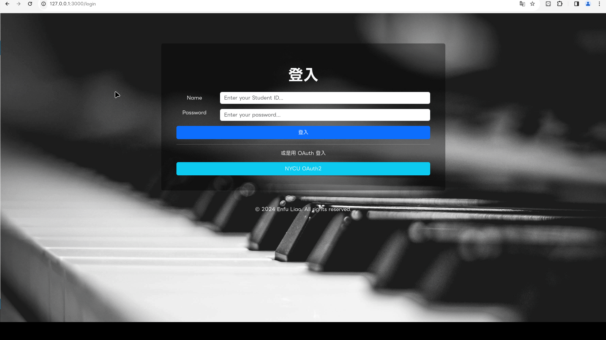

# Piano Room Reservation System

- Ruby version: ruby 3.3.0 (2023-12-25 revision 5124f9ac75) [x86_64-linux]
- Rails version: Rails 7.2.0.alpha
- Database: PostgreSQL 14.11

## Features

- **NYCU OAuth2 Integration:** Enable users to sign in using NYCU OAuth2 (https://id.nycu.edu.tw/) for Single Sign-On functionality.
- **Bootstrap 5**
- **Internationalization (i18n):** Support for English and Traditional Chinese languages.

## Known Issues

## Release Notes

## Planned Features

- [ ] Responsive Web Design (RWD) for mobile devices
- [ ] Dockerization
